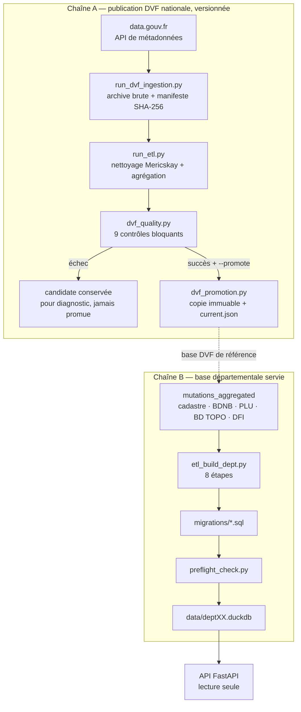

# Pipeline de données — quel script lancer, et pourquoi

`data-pipeline/` contient une trentaine de scripts. Trois seulement sont des
points d'entrée que l'on lance à la main. Cette page dit lesquels, ce que les
autres sont devenus, et ce que chaque chaîne garantit.

Deux chaînes indépendantes cohabitent. Elles ne produisent pas la même chose et
ne se lancent pas au même rythme.



La chaîne A suit le rythme des publications DVF. La chaîne B se rejoue quand on
ajoute un département ou une source d'enrichissement.

---

## Chaîne A — la publication DVF

C'est la partie versionnée du projet : ce qui est servi est traçable jusqu'à
l'URL et au hash du fichier téléchargé.

```bash
# Voir quelle publication est en ligne, sans rien télécharger
python data-pipeline/run_dvf_ingestion.py --dry-run

# Ingestion, transformation, contrôles qualité
python data-pipeline/run_dvf_pipeline.py --release 2026-07-17

# Idem, puis archivage immuable si les contrôles passent
python data-pipeline/run_dvf_pipeline.py --release 2026-07-17 --promote
```

| Script | Rôle |
|---|---|
| `run_dvf_pipeline.py` | **Point d'entrée.** Enchaîne ingestion, transformation, qualité, promotion. |
| `run_dvf_ingestion.py` | Point d'entrée secondaire : ingestion seule, ou `--dry-run` pour sonder la source. |
| `ingestion/dvf.py` | Client data.gouv, archivage sans écrasement, manifeste de provenance. |
| `dvf_io.py` | Découverte et lecture des CSV géolocalisés. |
| `run_etl.py` | **Transformateur DVF de référence** : nettoyage Mericskay, agrégation par mutation. |
| `dvf_quality.py` | Les 9 contrôles bloquants et le rapport JSON versionné. |
| `dvf_promotion.py` | Copie atomique vers `data/releases/`, pointeur `current.json`. |

### Ce que la chaîne garantit

- **Provenance.** Chaque run écrit un manifeste : URL, SHA-256, taille, millésime
  et statut de chaque ressource. Un chiffre servi par l'API remonte au fichier
  d'origine.
- **Qualité opposable.** Neuf contrôles bloquants — schéma canonique, unicité des
  mutations, champs requis, règles Mericskay (nature de vente, valeur et surface
  minimales), dates, prix au m², coordonnées — plus un garde-fou de régression :
  une candidate qui perd plus de 25 % du volume de la release approuvée est
  refusée. Le rapport est écrit **même en échec**, pour le diagnostic.
- **Immutabilité.** La promotion refuse d'écraser une release existante dont le
  hash diffère, et vérifie que le hash de la candidate correspond bien à celui
  du rapport qualité. Une release ne peut pas être remplacée en silence.

### Ce qu'elle ne garantit pas

Les fichiers DVF sont révisés par publication : une correction peut toucher un
millésime antérieur. Le pipeline ne présume donc jamais que seule l'année
courante bouge. Par ailleurs, l'absence de signalement d'anomalie dans une base
ancienne ne certifie rien — `is_outlier` peut être faux par défaut. Les limites
d'interprétation sont détaillées dans [METHODOLOGIE_DVF.md](METHODOLOGIE_DVF.md).

---

## Chaîne B — la base départementale servie

C'est ce que l'API ouvre en lecture seule.

```bash
# Orchestrateur complet : PLU, ETL, migrations, vérifications, tests
python data-pipeline/run_pipeline.py 35

# Uniquement les 8 étapes de construction
python data-pipeline/etl_build_dept.py 35
```

| Script | Rôle |
|---|---|
| `run_pipeline.py` | **Point d'entrée départemental.** Téléchargement PLU, puis `etl_build_dept`, migrations SQL, `preflight_check`, `validate_plu`, pytest. |
| `etl_build_dept.py` | Les 8 étapes de construction de la base. Appelé par le précédent, lançable seul. |
| `etl_build_steps/` | Les 8 étapes, une par module : `golden_join`, `densification`, `gpu`, `bdtopo`, `rnu`, `confidence`, `dfi`, `optimize`. |
| `preflight_check.py` | Vérifications post-migration avant déploiement. |
| `validate_plu.py` | Contrôle du mapping PLUi sur une commune réelle. |

### Sources à charger avant

Chaque source absente de `data/` fait simplement sauter son étape. L'API le
signalera par un `503 data_unavailable` plutôt que d'inventer une valeur.

| Script | Source | Sans elle |
|---|---|---|
| `etl_france_cadastre.py` | Parcelles cadastrales (GeoParquet IGN) | Pas de fond parcellaire ni de densification |
| `etl_france_bdnb.py` | BDNB (CSTB) — emprise et attributs bâtis | Pas d'emprise au sol, donc pas de CES |
| `download_plu_wfs.py` puis `import_plu.py` | Zonage PLU/PLUi (WFS GPU) | Zones `INCONNU`, pas de lecture urbanisme |
| `etl_dfi.py` | Documents de Filiation Informatisés (DGFiP) | Filiation cadastrale indisponible |
| `etl_poi.py` / `etl_osm_enrichment.py` | Points d'intérêt OpenStreetMap | `enrichment_available: false` — scores omis, jamais remplacés par 5/10 |

### Contenu réel de la base de démonstration

Base `data/dept35.duckdb` servie en production (Ille-et-Vilaine) :

| Table | Lignes | Contenu |
|---|---:|---|
| `mutations_aggregated` | 167 124 | Mutations DVF agrégées, 2014-01-02 au 2025-06-30, 333 communes |
| `france_foncier_test` | 164 941 | Jointure mutations × parcelles × BDNB (table « golden ») |
| `parcelles` | 2 420 317 | Fond parcellaire cadastral |
| `densification_scores` | 1 334 260 | CES actuel et potentiel, catégorie, surface constructible restante |
| `confidence_scores` | 1 334 260 | Indice de confiance multi-source |
| `dfi_filiations` | 826 838 | Filiations cadastrales (arpentage, lotissement, réunion) |
| `bdnb_stats` | 504 015 | Attributs bâtis agrégés |
| `plu_zones` | 21 960 | Zonage PLU, sur 287 communes partitionnées |

**Aucune table de points d'intérêt** : l'étape POI n'a pas été jouée pour ce
département. L'enrichissement de proximité est donc annoncé indisponible par
l'API et omis par l'interface, conformément à la règle du projet.

---

## Statut des autres scripts

Le répertoire porte son historique. Deux implémentations des mêmes étapes y
cohabitent : les modules de `etl_build_steps/` (ceux réellement exécutés, et
couverts par `tests/test_etl_build_steps.py`) et des scripts autonomes plus
anciens qui font le même travail. **Les modules d'étape ne les importent pas :
ce sont des réimplémentations, pas des enveloppes.**

| Script | Statut |
|---|---|
| `etl_dvf.py` | **Adaptateur historique**, conservé pour les imports existants. Ne pas l'utiliser pour une nouvelle base — `run_etl.py` est la référence. |
| `etl_densification.py` | Variante autonome de `etl_build_steps/densification.py`. Encore appelée par `run_etl_densification.ps1`. |
| `etl_confidence_score.py` | Variante autonome de `etl_build_steps/confidence.py`. Plus référencée nulle part. |
| `etl_gpu_integration.py` | Variante autonome de `etl_build_steps/gpu.py`. Plus référencée nulle part. |
| `etl_rnu_classification.py` | Variante autonome de `etl_build_steps/rnu.py`. Plus référencée nulle part. |
| `etl_bdtopo_bati.py` | Variante autonome de `etl_build_steps/bdtopo.py`. Plus référencée nulle part. |
| `etl_join_golden.py` | Variante autonome de `etl_build_steps/golden_join.py`. Plus référencée nulle part. |
| `etl_join_test_dept.py` | Jointure « golden » restreinte au département 35, datant de la mise au point. |
| `create_parcelles_enriched.py` | Table `parcelles_enriched` d'une méthodologie antérieure. Plus aucune référence. |
| `enrich_dvf_parcelles.py` | Liaison DVF vers parcelles antérieure au golden join. Plus aucune référence. |
| `optimize_analytics.py` | Index sur `date_mutation`, absorbé par l'étape `optimize`. Plus aucune référence. |
| `etl_enrichment.py` | `EnrichmentEtlPipeline`, exporté par `data-pipeline/__init__.py`. |

Les sept lignes marquées « plus référencée nulle part » sont des candidates à la
suppression : aucun script, test, workflow ou document du dépôt ne les appelle.
Elles sont conservées tant qu'une reprise manuelle d'une étape isolée reste
possible sur le serveur. Le jour où `etl_build_steps/` est jugé stable, les
supprimer retire la moitié du répertoire et lève l'ambiguïté sur ce qu'il faut
lancer.

---

## Automatisation

| Workflow | Déclenchement | Rôle |
|---|---|---|
| `dvf-source-check.yml` | Chaque lundi, 5 h 23 UTC | Sonde les métadonnées data.gouv sans rien télécharger, et publie la publication détectée dans le résumé du run. |
| `dvf-release.yml` | Manuel (`workflow_dispatch`) | Rejoue la chaîne A sur un runner dédié, archive rapport qualité et manifestes pendant 90 jours. La promotion est un choix explicite de l'opérateur. |

Voir [GITHUB_AUTOMATION.md](GITHUB_AUTOMATION.md).
